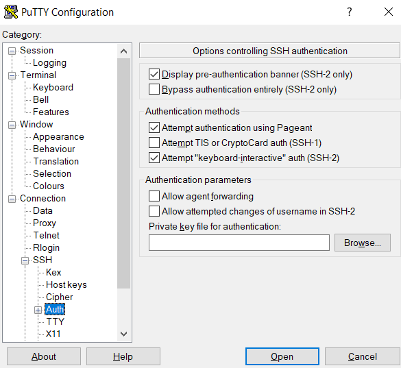

# Embedded Systems "IoT in der Cloud"

## Aufgabenstellung
Die detaillierte [Aufgabenstellung](TASK.md) beschreibt die notwendigen Schritte zur Realisierung.

## Recherche

[Link](https://www.overleaf.com/read/tskpsrxqbmhb) zum Theorieprotokoll

## Participants

* Fabian Traxler
* Karim Omar
* Sam Hediyehloo

## Tasks

* Grafana in der Cloud 
* InfluxDB in der CLoud
* Raspberry
  * Konfigurieren
  * Sensoren
    * Temparature DHT11
    * Pressure BMP280
    * Nice to have
      * Windgeschwindigkeit (evtl. einen basteln)
  * Skript schreiben


## Implementierung
### Erstellen einer Linux Instanz
as
### Verbindung mit der Amazon AWS Linux Instanz (Windows)
#### Konvertieren des privaten Schlüssels
Man benötigt die ```.pem``` Datei, die beim Erstellen der Linux Instanz auch erstellt wird. In **puttygen** muss nun eine ```.ppk``` Datei erstellt werden, die für die Verbindung benötigt wird. 


Unter **load** muss das .pem File geladen werden. Die Konfigurationen sollen wie im Bild ausgewählt werden. Nun muss man auf **save private key** drücken um den privaten Schlüssel zu erstellen. 

#### Putty Konfigurationen
Eine ssh Session soll erstellt werden mit dem hostname

		ubuntu@ec2-OUR_SECRET:).eu-central-1.compute.amazonaws.com

Jedoch muss noch der private Key mitgegeben werden. Unter Connection/SSH/Auth **Browse** drücken und den private Key auswählen.



### Installation von Influxdb

```bash
	echo "deb https://repos.influxdata.com/ubuntu bionic stable" | sudo tee /etc/apt/sources.list.d/influxdb.list
	
	sudo curl -sL https://repos.influxdata.com/influxdb.key | sudo apt-key add -
	
	sudo apt-get install -y influxdb
	sudo apt install influxdb-client
```
Die InfluxDB Shell wird mit folgendem Command geöffnet

```shell
	influx -precision rfc3339
```
#### Installation von Grafana

```shell
	sudo apt-get install -y apt-transport-https
	
	sudo apt-get install -y software-properties-common wget #möglicherweise notwendig#
	
	wget -q -O - https://packages.grafana.com/gpg.key | sudo apt-key add -
	
	sudo add-apt-repository "deb https://packages.grafana.com/oss/deb stable main"
	
	sudo add-apt-repository "deb https://packages.grafana.com/oss/deb beta main"
	
	sudo apt-get install grafana
```
Anschließend muss Grafana auch gestartet werden

```shell
	sudo systemctl daemon-reload
	sudo systemctl start grafana-server
	sudo systemctl enable grafana-server.service
```

## Quellen
* [Influxdb](https://computingforgeeks.com/install-influxdb-on-ubuntu-18-04-and-debian-9/)
* [Grafana](https://grafana.com/docs/grafana/latest/installation/debian/)

 